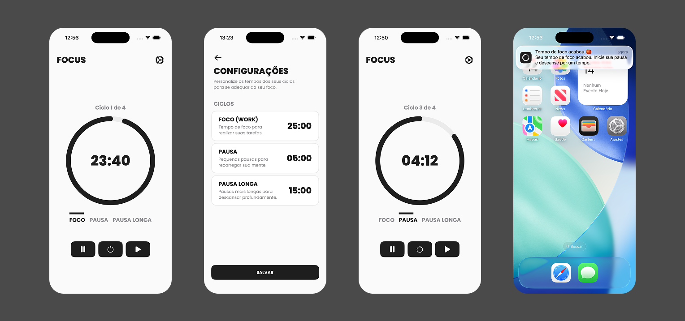

<h1 align="center" style="font-weight: bold;">🍅 Focus</h1>

<p align="center">
 <a href="#tech">Technologies</a> • 
 <a href="#about">Features</a> • 
 <a href="#architecture">Architecture</a> • 
 <a href="#started">Getting Started</a>
</p>

<p align="center">
    <b>A native iOS Pomodoro timer designed to help users stay focused and manage work and break cycles.</b>
</p>

<h2 id="layout">🎨 Layout</h2>

<p align="center">
    
</p>

<h2 id="tech">💻 Technologies</h2>

- Swift
- UIKit
- MVVM-C
- UserDefaults
- UserNotifications
- Auto Layout
- Core Animation
- Swift Package Manager

<h2 id="about">✨ Features</h2>

- Start, pause and resume focus sessions
- Configure custom durations for work, short break and long break cycles
- Automatically manage Pomodoro cycle transitions
- Four completed focus sessions trigger a long break
- Manually start each new cycle
- Real-time countdown timer
- Visual timer progress indicator
- Display the current Pomodoro cycle
- Personalized local notifications when timers finish
- Persist timer settings locally
- Maintain timer state across app lifecycle changes
- Fully programmatic UI built with UIKit and Auto Layout

<h2 id="architecture">🏗 Architecture</h2>

The project follows an <b>MVVM-C</b> architecture, separating responsibilities across the different layers of the application.

- <b>Model</b> — Represents the application's timer state and configuration
- <b>View</b> — Handles the user interface and user interactions
- <b>ViewModel</b> — Handles timer logic, Pomodoro cycles and prepares data for the View
- <b>Service</b> — Handles timer execution and system notifications
- <b>Coordinator</b> — Manages navigation between screens

<h2 id="timer">⏱ Timer Logic</h2>

The timer uses a time-based approach instead of simply decrementing a counter every second.

When a session starts, the application stores the expected <b>end date</b> and calculates the remaining time based on the current date.

This keeps the timer accurate when the application moves to the background or the device is locked.

The Pomodoro cycle follows this sequence:

- Work
- Short Break
- Work
- Short Break
- Work
- Short Break
- Work
- Long Break

After four completed Work sessions, the user enters a Long Break. After the Long Break finishes, a new Work cycle begins.

New sessions are not started automatically. After a timer finishes, the user must manually start the next cycle.

<h2 id="notifications">🔔 Notifications</h2>

The application uses <b>UserNotifications</b> to notify the user whenever a timer finishes.

Notifications are scheduled when a timer starts, allowing the system to deliver them even when the application is running in the background.

Each timer mode has its own notification message, providing contextual feedback for the current session.

<h2 id="settings">⚙️ Timer Settings</h2>

Timer durations can be customized by the user through the Settings screen.

The following values can be configured:

- Work duration
- Short Break duration
- Long Break duration

Settings are persisted locally using <b>UserDefaults</b> and loaded dynamically by the timer when the application starts.

<h2 id="started">🚀 Getting Started</h2>

To run this project, you will need:

- macOS
- Xcode
- Swift
- iOS Simulator or a physical iOS device

<h3>Cloning</h3>

Clone the repository:

```bash
git clone https://github.com/joaogkvalho/focus.git
```

<h3>Opening the project</h3>

Navigate to the project directory:

```bash
cd focus
```

Open the project in Xcode:

```bash
open focus.xcodeproj
```

<h3>Running</h3>

After opening the project in Xcode:

1. Select an iOS Simulator or a connected iOS device.
2. Select the application scheme.
3. Press <b>⌘ + R</b> to build and run the project.

<h2 id="author">👨‍💻 Author</h2>

<p>

```
João Gabriel Carvalho
```

</p>
